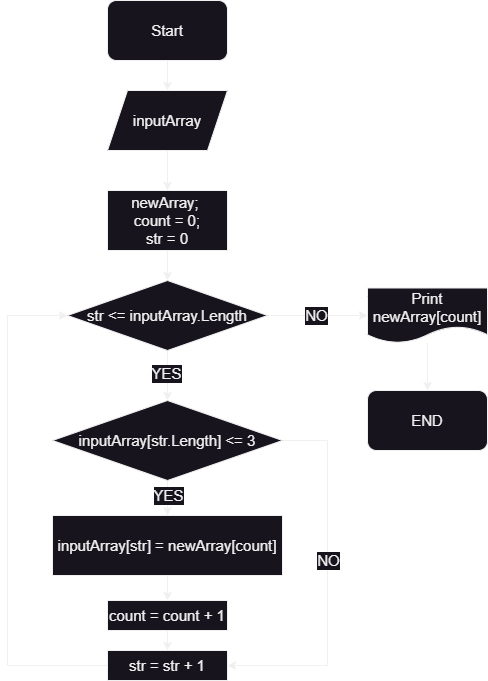

# Приложение блок-схемы работы основного алгоритма Формирования нового массива из строк старого массива длинной <= 3 симолов:



# Описание работы кода в 'Program.cs':

## 1.Ввод массива строк с клавиатуры:
* Первым делом я написал код для того, что бы пользователь мог заполнить массив __*inputArray*__, введя через запятую - символы, слова, числа. 
Запятая в данном случае делит введеное пользователем значение на элементы массива.
```sh
Console.WriteLine("Введите элементы массива через запятую:");
string input = Console.ReadLine()!;
string[] inputArray = input.Split(',')!;
```

## 2.Формирование нового массива *"newArray"* из строк массива *"inputArray"* длиной <= 3 символа: 
* Создание нового массива __*newArray*__ длинной массива __*inputArray*__.
```sh
string[] newArray = new string[inputArray.Length];
```
* Создание новой переменной __*count*__ с значением "0" является индексом элементов массива __*newArray*__.
```sh
int count = 0;
```
* В цикле **foreach** проверяем каждый элемент массива __*inputArray*__ на равенство __*"<= 3"*__ через цикл **if**.
Если(**if**) элемент соответсвует равенству, то он записывается в массив __*newArray*__ под индексом равному значению __*count*__, и к значению __*count*__ прибавляется 1.
```sh
foreach (string str in inputArray)
        {
            if (str.Length <= 3)
            {
                newArray[count] = str;
                count++;
            }
        }
```

## 3.Вывод нового массива на экран:
* В цикле **for** каждый элемент массива __*newArray*__ выводится на экран по очереди.
```sh
Console.WriteLine("Новый массив из строк длиной <= 3 символов:");
        for (int i = 0; i < count; i++)
        {
            Console.Write(newArray[i] + " ");
        }
```
